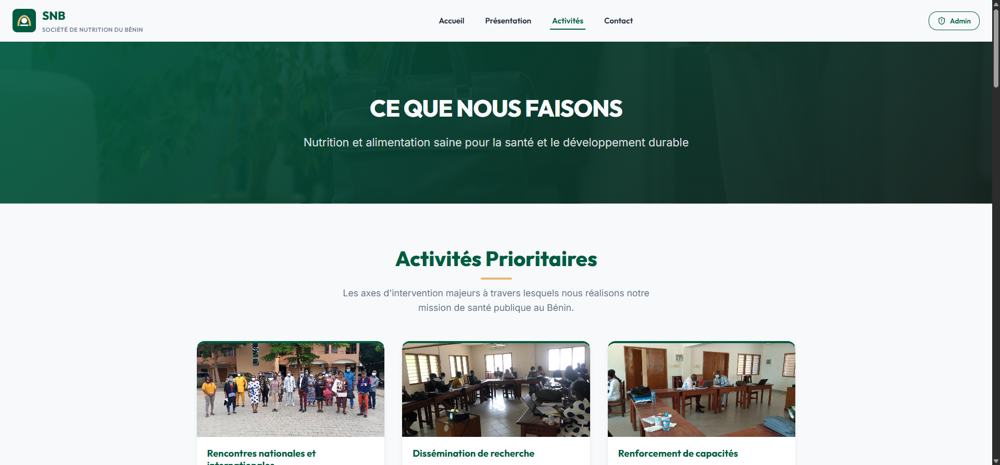
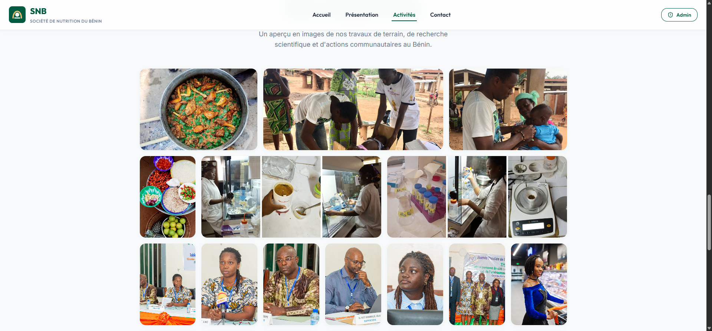
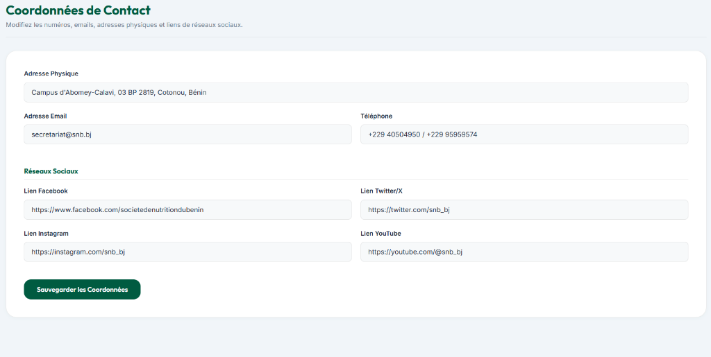

# 🥗 Refonte du Portail Officiel — Société de Nutrition du Bénin (SNB)

> **Nom de domaine de production :** [https://snb.bj/](https://snb.bj/)

Ce dépôt héberge le code source complet de la refonte totale et modernisée du site web officiel de la **Société de Nutrition du Bénin (SNB)**. C'est une plateforme web performante, sécurisée, moderne et entièrement adaptative (responsive), conçue pour promouvoir la nutrition saine et le développement durable au Bénin.

---

## 📸 Aperçu de l'Interface

Voici quelques captures d'écran illustrant le design moderne et premium développé pour cette refonte :

### Page d'Accueil Publique (`https://snb.bj/`)
*Dotée d'un bandeau déroulant interactif (Ticker), d'un style épuré aux couleurs de l'association, et d'un accès aux actualités sous forme de cartes d'articles avec visionneuse premium (Modal).*


### Page des Activités & Rapports d'Intervention
*Présentation claire des axes d'intervention de la SNB et accès aux rapports détaillés.*


### Galerie Photo Officielle
*Une disposition asymétrique moderne s'adaptant de manière fluide à toutes les résolutions d'écran.*


### Tableau de Bord Administrateur (`/admin`)
*Console d'administration sécurisée permettant la gestion dynamique des contenus, le paramétrage cloud Supabase, la boîte de réception des messages, les adhésions et le journal d'activité.*


---

## ✨ Fonctionnalités Majeures

### 💻 Portail Public Réactif & Premium
- **Design System HSL Curaté** : Palette inspirée de l'identité de la SNB (Vert Émeraude, Sauge, Or) avec typographies modernes (Google Fonts *Outfit* & *Inter*), micro-animations et effets de verre (glassmorphism).
- **Entièrement Responsive** : Adaptation absolue sur mobiles (iPhone, Android) et tablettes. Menu hamburger mobile fluide et masquage adaptatif pour éviter tout débordement (overflow) horizontal.
- **Règles Typographiques Françaises** : Gestion des espaces insécables (`&nbsp;`) avant la double ponctuation (`!`, `?`) pour éviter les retours à la ligne orphelins.

### 📝 Formulaire d'Adhésion en Ligne Premium (`/adhesion`)
- Formulaire d'inscription pour les experts et volontaires (niveau académique minimum requis : Licence).
- **Zone d'Upload Drag & Drop** interactive pour la demande d'adhésion et le CV.
- **Encodage Base64 automatique** des pièces jointes en local pour les stocker directement en base de données sans nécessiter de serveur de stockage externe (Storage Bucket) complexe.

### 🛡️ Protection Anti-Robot Invisible (Spam Gate)
- **Honeypot (Champ Piège)** : Champ invisible `website` bloquant instantanément les scripts automatisés s'ils le remplissent.
- **Time-Lock (Délai minimal)** : Blocage des soumissions effectuées en moins de 3 secondes pour écarter les requêtes de bots.
- **Rejet Silencieux** : Les robots reçoivent un message de succès simulé mais aucune donnée n'est envoyée pour préserver l'intégrité de vos bases de données.

### 🔐 Console d'Administration Secrète (`/admin`)
- **Accès Masqué par URL** : Aucun lien vers l'administration n'apparaît publiquement dans la barre de navigation. L'accès se fait directement en tapant `/admin` dans l'URL.
- **Connexion Nominative Sécurisée** : L'administrateur doit saisir son Nom complet et le mot de passe de sécurité pour s'identifier.
- **Gestionnaire de Contenus** : Ajout, modification, et suppression en temps réel :
  - Articles, actualités et bandeau déroulant (Ticker).
  - Membres du Conseil d'Administration.
  - Activités, partenaires et rapports d'événements.
- **Boîte de Réception Intégrée** : Consultation des messages de contact et des demandes d'adhésion avec options de téléchargement direct des CV et lettres de motivation décodés à la volée.

### 📋 Journalisation & Audit d'Activité
- Enregistrement nominatif de toutes les écritures administratives (qui a fait quoi et quand).
- Catégorisation visuelle des actions (Créations en vert, Modifications en orange, Suppressions critiques en rouge).
- **Nettoyage automatique** des logs datant de plus de 30 jours (localement et sur le cloud) pour rester en conformité avec la réglementation sur la protection des données (RGPD / Loi Béninoise N° 2017-20).

---

## 🛠️ Stack Technique

- **Frontend** : React 18, Vite (compilateur ultra-rapide).
- **Design & Icons** : CSS3 natif pur (Design System personnalisé), Lucide React.
- **Routage SPA** : Système réactif géré au niveau de l'état `AppContext` pour éviter les lenteurs et permettre des transitions instantanées.
- **Base de Données / API** : Mode Hybride (Local via `localStorage` pour démonstration / Cloud en temps réel via l'API REST PostgREST de **Supabase**).
- **Déploiement** : Configurations Vercel (`vercel.json`) et Netlify (`_redirects`) incluses pour forcer la redirection SPA `/admin` et `/legal` vers `index.html` (évite les erreurs 404 au rafraîchissement).

---

## 🚀 Démarrage Rapide (Développement Local)

### Prérequis
- [Node.js](https://nodejs.org/) (v16 ou supérieur)
- Un gestionnaire de paquets (npm, yarn, pnpm)

### Installation
1. Clonez le dépôt GitHub :
   ```bash
   git clone https://github.com/krissiankg/SNB.git
   cd SNB
   ```

2. Installez les dépendances :
   ```bash
   npm install
   ```

3. Configurez vos variables d'environnement en dupliquant le fichier `.env.example` en `.env` :
   ```bash
   cp .env.example .env
   ```
   Remplissez les clés de votre projet Supabase si vous souhaitez l'activer :
   ```env
   VITE_SUPABASE_URL=https://[votre_projet].supabase.co
   VITE_SUPABASE_ANON_KEY=[votre_cle_anon_publique]
   ```

4. Lancez le serveur de développement :
   ```bash
   npm run dev
   ```
   Le site est désormais accessible localement sur `http://localhost:5173/`.

---

## 🏗️ Structure de la Base de Données Supabase

Si vous activez la synchronisation Cloud dans le panneau d'administration, créez les tables suivantes sur votre projet Supabase avec les schémas SQL ci-dessous :

### 1. Table `messages` (Messages de Contact)
```sql
create table messages (
  id uuid default gen_random_uuid() primary key,
  name text not null,
  email text not null,
  subject text not null,
  message text not null,
  is_read boolean default false,
  date timestamp with time zone default timezone('utc'::text, now())
);
```

### 2. Table `adhesions` (Candidatures de Membres)
```sql
create table adhesions (
  id uuid default gen_random_uuid() primary key,
  last_name text not null,
  first_name text not null,
  email text not null,
  status text default 'En attente', -- 'En attente', 'Accepté', 'Refusé'
  application_letter_name text,
  application_letter_data text,      -- Encodé en Base64
  cv_name text,
  cv_data text,                      -- Encodé en Base64
  date timestamp with time zone default timezone('utc'::text, now())
);
```

### 3. Table `audit_logs` (Journal d'activité)
```sql
create table audit_logs (
  id uuid default gen_random_uuid() primary key,
  admin_name text not null,
  action_type text not null,        -- 'Connexion', 'Ajout', 'Modification', 'Suppression'
  details text not null,
  date timestamp with time zone default timezone('utc'::text, now())
);
```

---

## 📦 Compilation & Déploiement en Production

Pour compiler l'application de façon optimisée pour la production sur `https://snb.bj/` :

```bash
npm run build
```

Les fichiers statiques seront générés dans le dossier `/dist`.

### Déploiement Cloud (Vercel, Netlify)
- Liez votre dépôt GitHub à votre plateforme de déploiement.
- Renseignez les variables d'environnement `VITE_SUPABASE_URL` et `VITE_SUPABASE_ANON_KEY` dans l'interface d'administration de l'hébergeur.
- L'application se construira automatiquement à chaque commit et verrouillera les paramètres de synchronisation cloud pour empêcher les modifications accidentelles.

---

## 🤝 Contribution & Droits d'auteur

Ce site est la propriété intellectuelle de la **Société de Nutrition du Bénin (SNB)**. 
Conçu et réalisé par **GUELICHWEB** (Site web : [https://guelichweb.online/](https://guelichweb.online/)).
